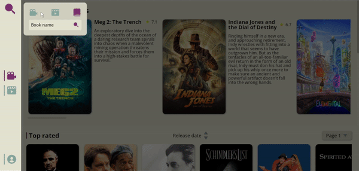
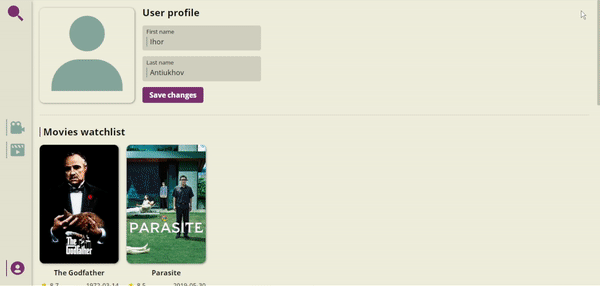
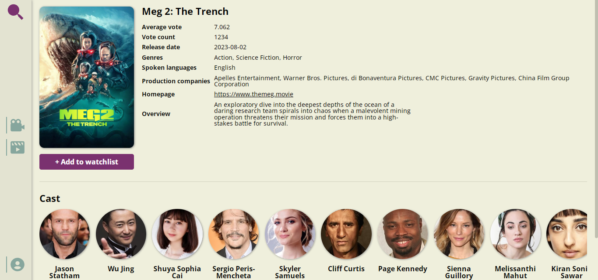

## Movie Book Finder

**Movie Book Finder** is a React JS application for searching movies, series and books using [TMDB API](https://developer.themoviedb.org/docs) and [Google Books APIs](https://developers.google.com/books).

The main page contains **lists of trending movies, top rated movies, upcoming movies, and movies currently playing**. Using the sidebar, you can switch between pages of movies and series.

Clicking on a movie poster or book cover will take you to a page with more detailed information about that movie or book. **You can add a movie to a watchlist, or a book to a reading list, which are displayed on the user's page.**

## Application demo

### Movies page


### Movie search


### Book search



### User page



### Movie info page



## Installation

1. Install Node.js *(in case you haven't installed it)*.
2. [Download the source code](https://github.com/IhorAntiukhov/movie-book-finder.git) and open a command prompt in the project's root folder.
3. Install the dependencies needed for the application.

```
npm install
```
4. Start React project and development server.

```
npm start
```
5. Open a new command prompt window, navigate to the project root folder again, and start the JSON server to permanently store watchlists with movies, series, and a reading list with books.

```
npm run start:server
```

## Libraries and tools

This app was built using **Create React App**, **Redux Toolkit**, **RTK Query**, **SCSS**, and **JSON Server** library.
